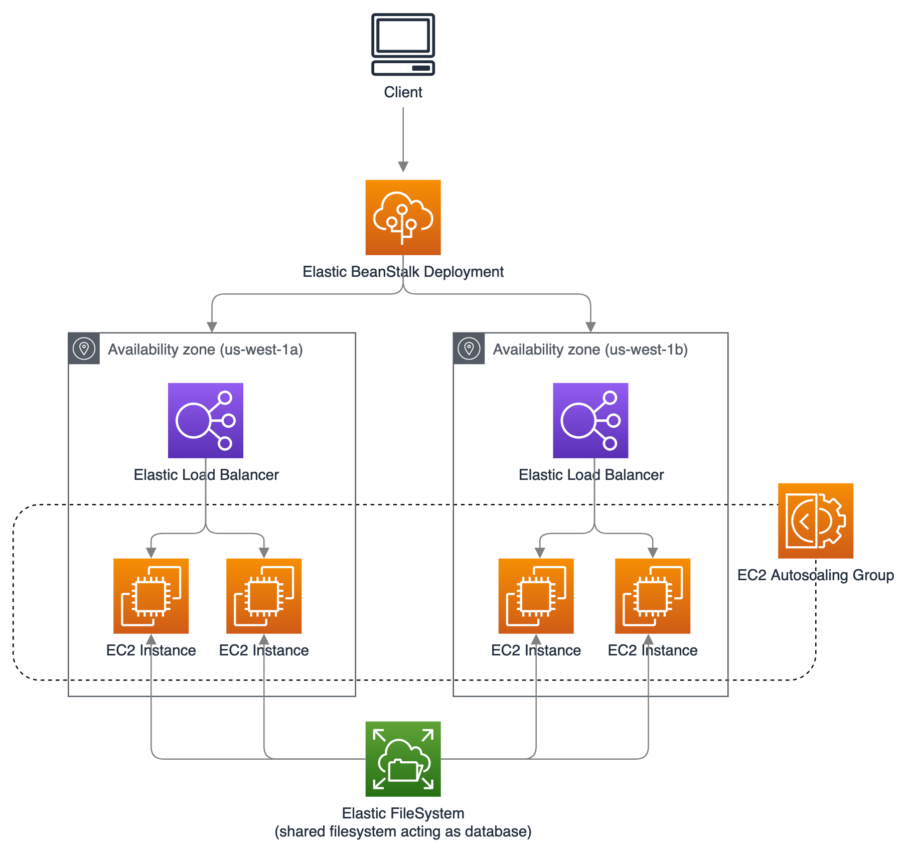

# Deploy

We chose AWS Elastic Beanstalk as our method of deployment because of its (1) speed of provisioning all necessary resources, (2) low complexity, and (3) high availability features.
To learn more about all the deployment options we considered, refer to the [CONSIDERATIONS.md](./CONSIDERATIONS.md) document



<!--  -->

## Setup

```bash
# Install
brew install awsebcli

# Initialize app in Elastic BeanStalk
pip freeze > requirements.txt
eb init sample-star -p python-3.8 --region us-west-1
eb init
```

## Deploy app to new environment

```bash
# Create environment from app
eb create sample-star-env -v --min-instances 4 --max-instances 8

# Redeploy new source code
eb deploy

# Adjust the number of running instances
eb scale 2 sample-star-env

# Terminate the environment
eb terminate
```

## References

- <https://docs.aws.amazon.com/elasticbeanstalk/latest/dg/services-efs.html>
